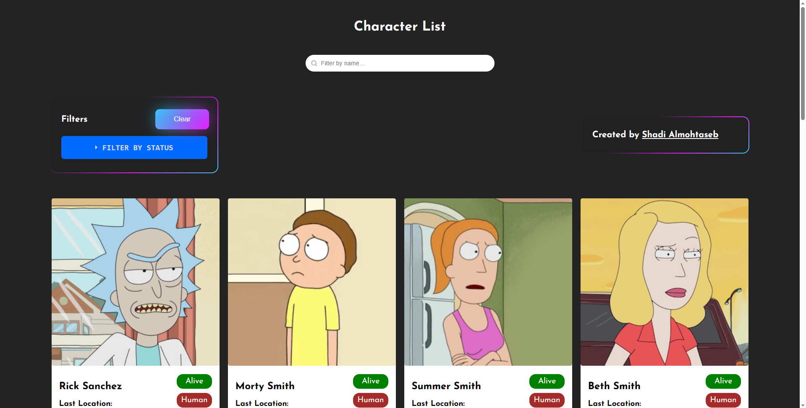
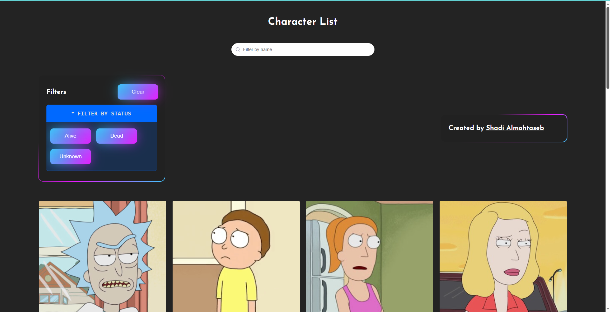
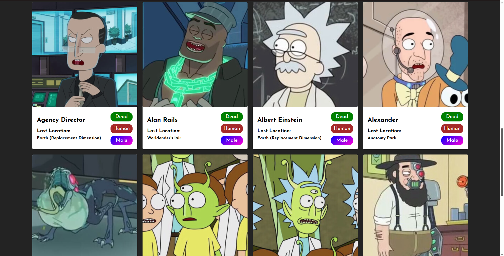
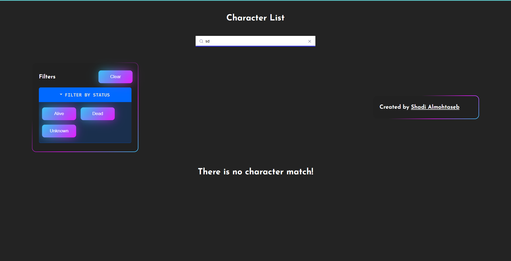

# Day5 -- Wiki Character Search App

In this project, I learned how to fetch data from API and how to filter it by category, and also how to search for a specific item by its name, I built the app with a beautiful UI with a responsive and modern design.

## Learning Objectives

- Fetch Requests
- API Concept
- CSS for styling
- Responsive Design
- Modern UI

## Demo for another app that I built previously using React.js

this is just another demo for the same API built with React.js.

https://wiki-topaz-seven.vercel.app/

and this is the GitHub repo for that app:

https://github.com/Shadi-Almohtaseb/WiKi-React-App/tree/master

## App Preview

